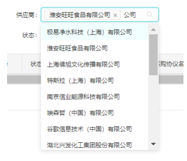

# H0 - 框架Lov搜索组件v1.0

LOV搜索组件是在原LOV组件的基础上重构而成，因此LOV的部分属性在在LOV搜索组件上也适用。


## 组件说明

Lov通过输入框自动检索需要填入的内容，不用点击弹框后选中再关闭弹框，减少操作。
与C7N的Lov输入效果保持一致。




## 如何使用

```javascript
import MultipleLov from '@/routes/components/MultipleLov';

<MultipleLov
    mode='single'
    code="SPCM.USER_AUTH.SUPPLIER"
    textField="supplierCompanyName"
    queryParams={{ tenantId }}
/>
```

Lov搜索的所有组件属性如下，其他属性同LOV组件

| 参数 | 说明              | 类型   | 默认值 | 可选值          | 必输 |
| ---- | ----------------- | ------ | ------ | --------------- | ---- |
| mode | Lov是单选还是多选 | string | single | single/multiple | 否   |


## 弹框功能说明

- 全选: 将符合当前左侧查询条件的所有数据追加到已选列表
- 查找(右侧): 在已选列表中查找
- 清除: 清空已选的数据