# 二、React Developer Tools插件调试

## 1、安装 React Developer Tools 扩展

下载插件，打开谷歌浏览器的扩展程序管理，把.crx文件拖拽到程序管理里面就可以完成安装，下图为安装完成。

下载地址：[https://crxdl.com](https://crxdl.com)

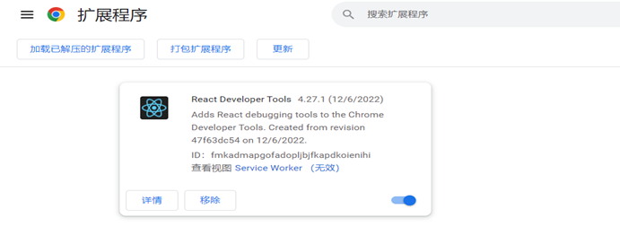

## 2、验证安装

安装完成后会在浏览器右上角的地址栏旁边显示一条成功消息和一个新图标，在一个没有任何 React 组件的页面上时，该图标将显示为灰色。但是，如果您在带有 React 组件的页面上，图标将显示为蓝色和绿色。如果单击该图标，它将表明该应用程序正在运行 React 的生产版本。
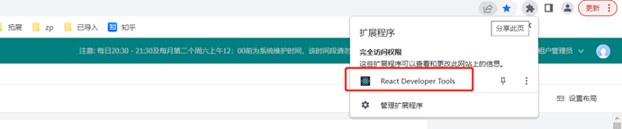
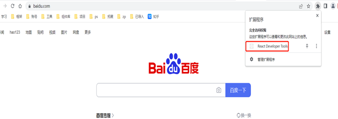

## 3、浏览器F12控制台多出两个选项卡：Components和Profiler
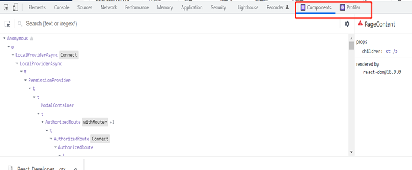
Components该组件标签会显示当前阵营组件树，与任何道具，状态，或上下文一起。

该探查器选项卡可以让你记录的互动和测量组件的渲染。由于这是一个生产版本，代码将被[缩小](https://en.wikipedia.org/wiki/Minification_(programming))并且组件将没有描述性名称。

实时并观察当前的 props 和状态，而无需控制台语句或调试器。

## 4、识别实时组件道具和上下文--小实例

分析文本块

- 使用 React Developer Tools 来探索每个组件的当前状态和 props

- 使用 React Developer Tools 查看深度嵌套组件中的当前上下文
   - 使用这些工具来识别在状态更改时重新呈现的组件
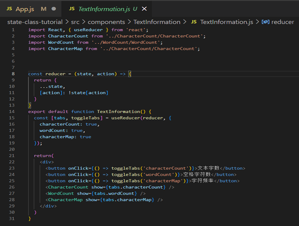
   
   
   
   **实例**：
   
   以下demo确定并报告输入字段文本的字数、字符数和字符频率
   
   1. 创建一个上下文来保存`<textarea>`元素的值。使用useStateHook捕获数据
   
      **开发者工具中的更新值**：Hook 也有一个通用名称State，但这不像上下文那样容易更新。在这种情况下，单击TextContext.ProviderReact Developer Tools 中的 ，将看到value也反映了我们使用状态设置的输入值。
   
      App.js
      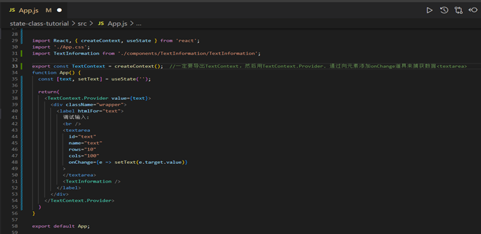
   
      
   
   2. 上下文的更新值
   
      接下来，添加一个名为`TextInformation`. 该组件将是具有特定数据分析（例如字数）的组件的容器。
   
      组件由三个独立的部分组成：`CharacterCount`，`WordCount`，和`CharacterMap`。
   
      该`TextInformation`组件将使用`useReducer` `Hook 来切换每个组件的显示。`
      
      创建一个`reducer`函数来切换每个组件的显示值和一个按钮来切换每个组件的`onClick`动作
      
      
      
      
      (1) CharacterCount：组件内部创建一个使用showprop 并显示null`if`show为假的函数。
      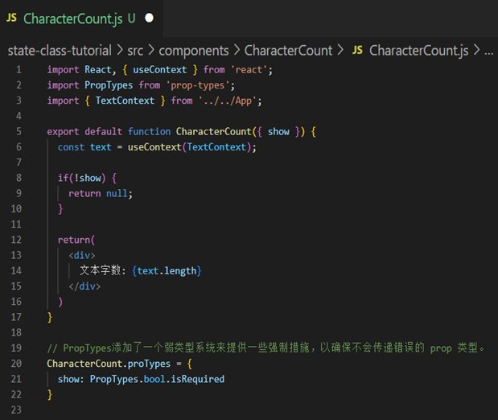
      
      
      
      (2) WordCount组件：类似于 的组件CharacterCount，但在显示长度之前使用空格的split方法创建一个单词数组。
      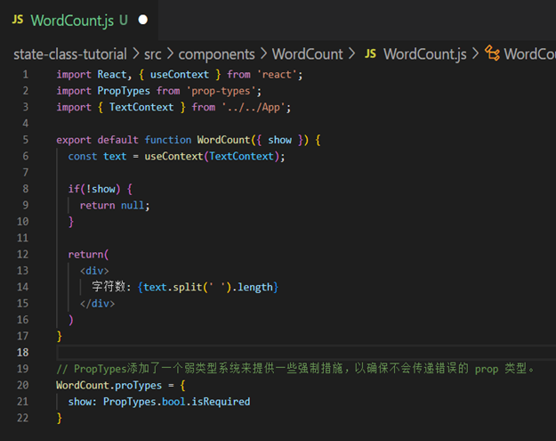
      
      
      
      (3) CharacterMap组件: 显示特定字符在文本块中的使用频率.需要一个稍微复杂的函数来为每个字母创建频率图。需要遍历每个字符并在出现重复时增加一个值。然后，需要获取该数据并对其进行排序，以便最常见的字母位于列表顶部。
​	  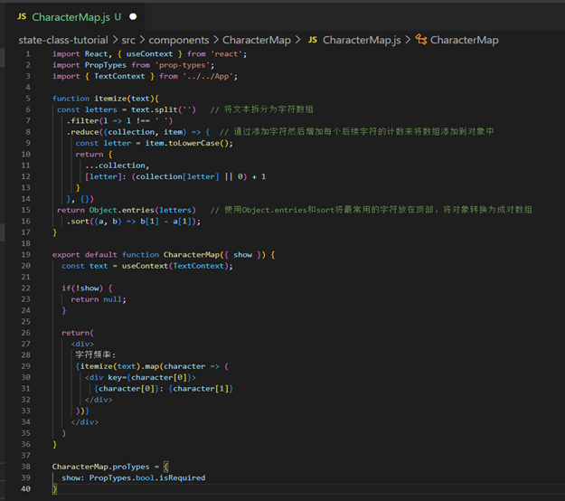
      
      
      
      ​	  在输入中输入一些文本，将在 React Developer Tools中组件的**hooks**部分下看到更新的值。
      ​	  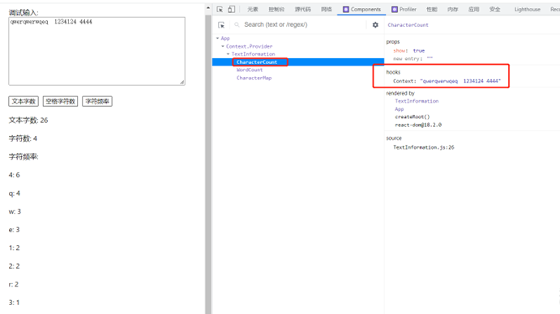
      
      
      
      ​	  也可以手动更新
      ​	  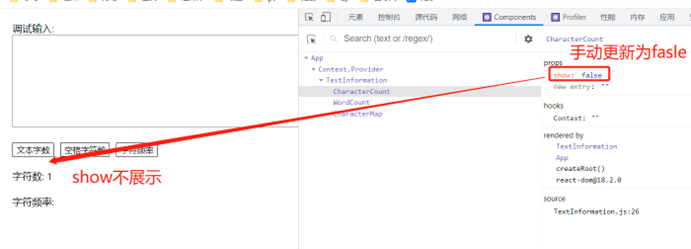
      
      

## 5、跨交互跟踪组件渲染

使用 React Developer Tools 分析器来跟踪组件渲染和重新渲染。

浏览应用相关优化指标的火焰图或可视化，并使用这些信息来识别低效组件、减少渲染时间并提高应用速度。

（1）查看组件如何相互更改的一种快速方法是在重新渲染组件时启用突出显示。这将直观地了解组件如何响应不断变化的数据。勾选设置中General的高亮。

​		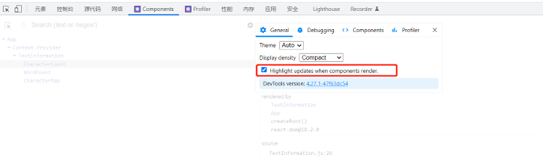

​		当进行任何更改时，React Developer Tools 将突出显示重新渲染的组件.例如，当更改输入时，每个组件都会重新渲染，因为数据存储在根级别的 Hook 上，		并且每次更改都会重新渲染整个组件树。

​		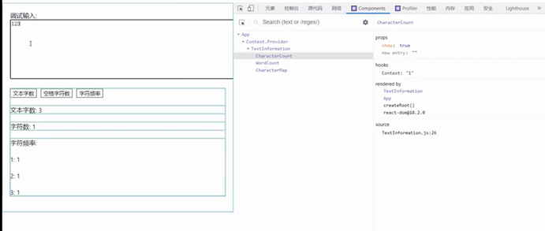

​		

​		将其与单击其中一个按钮以切换数据时组件重新呈现的方式进行比较,如果单击其中一个按钮，下面的组件`TextInformation`将重新渲染，但不会重新渲染根		组件,显示重新渲染能快速了解组件之间的关系

​		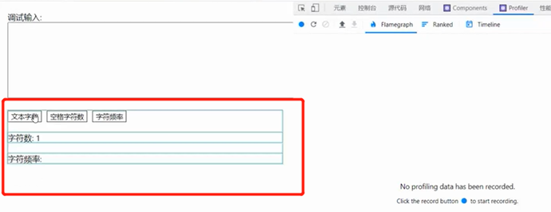

​		

（2）设置将勾选高亮设置取消，单击控制台中的**Profiler**选项卡，要使用分析器，单击屏幕左侧的蓝色圆圈开始录制，完成后再次单击它，停止录制时，会发现		组件更改的图表，包括每个项目的渲染时间。

​		随意粘贴文本，启动分析器，然后对输入进行一些小的更改。在组件完成重新渲染后停止分析。会有长时间的停顿，因为应用程序正在处理长时间的重新渲		染。

​		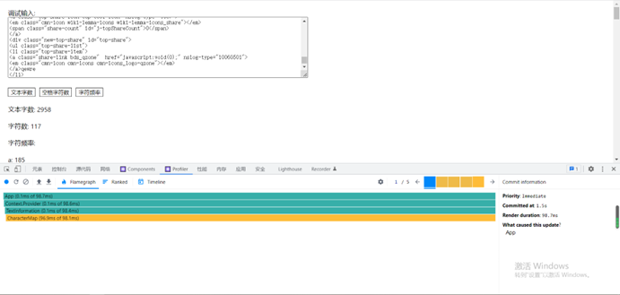

​		结束录制时，React Developer Tools 将创建一个火焰图，显示重新渲染的每个组件以及重新渲染每个组件所需的时间更改每次按键都会导致重新渲染，更重		要的是，它显示了每次渲染需要多长时间以及为什么会有很长的延迟。组件`App`、`TextContext.Provider`和`TextInformation`重新渲染大约需要 0.1 毫		秒。但是`CharacterMap`由于`itemize`函数中复杂的数据解析，组件每次击键需要大约 1 秒的时间来重新渲染。

​		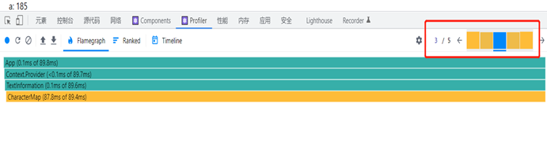

​		React Developer Tools 帮助隔离了一个问题：`CharacterMap`组件重新渲染并在任何父组件更改时执行昂贵的计算。

​		解决这个问题，可以使用内置的Reactmemo函数来记忆整个组件。

​		`memo`从 React导入，然后将整个函数传递给`memo`函数：

​		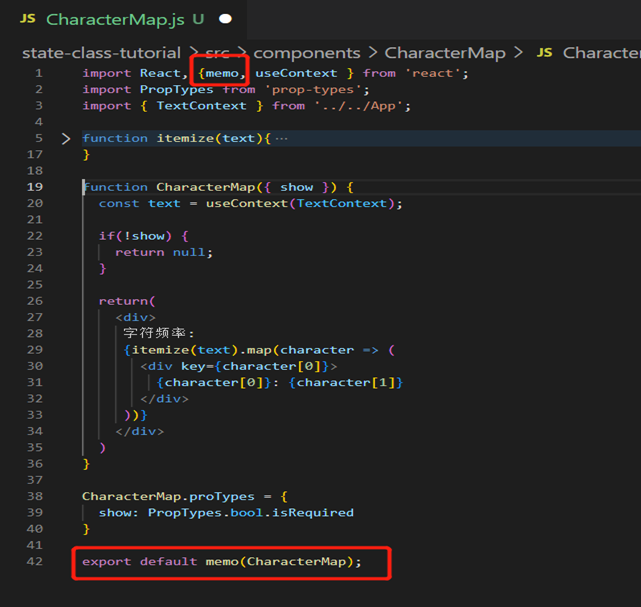

​		切换 时`WordCount`，组件的更新速度会快得多。这一次，`CharacterMap`不重新渲染。相反，在 React Developer Tools 中，我们会看到一个灰色矩形，显		示已阻止重新渲染。

​		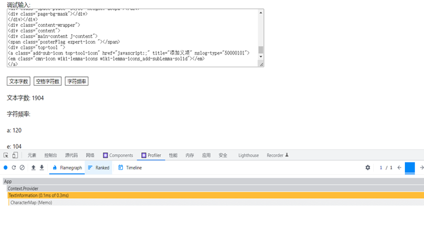