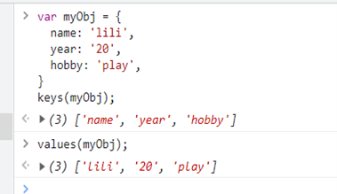

# 一、Chrome基础调试

chrome开发者工具最常用的四个功能模块

- **Elements**：主要用来查看前面界面的html的Dom结构，和修改css的样式。css可以即时修改，即时显示。大大方便了开发者调试页面
- **Console**：这个除了查看错误信息、打印调试信息(console.log())、写一些测试脚本以外，还可以当作Javascript API查看用。例如我想查看console都有哪些方法和属性，我可以直接在Console中输入”console”并执行
- **Sources**：主要用来调试js和查看源代码
- **Network**：前后端请求交互，http超文本传输协议

## 1、css调试（Element源码定位）

（1）打开测试工具，点击箭头，在页面中选择要审查的元素，此时会定位在代码块，会有html及css布局的展示，可进行动态更改排查问题

（2）**伪类调试**--一般情况是看不到的，需要勾选

​		

（3）**$0**--浏览器开发者工具当前选中的元素

​		第一步，我们F12打开开发者工具

​		第二步，我们在元素面板中随便选中一个元素，看看元素尾部这个$0

​		第三步，我们在Console控制台去输入这个$0，并回车，就可以获取这个dom元素了。能获取dom元素，自然就能修改dom元素

​		

​		

## 2、console控制面板使用、debugger

1. 控制台或代码中善用console，它会清晰的打印出我们在执行中数据的值，方便查看

   - console.log用于输出普通信息

   - console.info用于输出提示性信息

   - console.error 用于输出错误信息

   - console.warn 用于输出警示信息

   - console.debug 用于输出调试信息

   - console.count 用于记录代码执行几次

   - keys和values前者返回传入对象所有属性名组成的数据，后者返回所有属性值组成的数据
     
     
     

     

2. 代码中也可以使用debugger,它会在我们点击功能时在控制台看到数据进行调试

   （1）直接根据页面在对应的位置找到源码进行断点设置(眼睛是一直执行下一步逻辑的意思，箭头是继续执行下一个断点，直到结束完成)
   

   - 箭头：停止断点调试

   - 眼睛：不跳入函数中去，继续执行下一行代码（F10）

   - 向下的箭头：跳入函数中去（F11）

   - 向上的箭头：从执行的函数中跳出

   - 带斜杠的图标：禁用所有的断点，不做任何调试

   - 最后一个图标：程序运行时遇到异常时是否中断的开关

     

   （2）使用场景（一个同事遇到form表单值更新调试的问题）

   ​		下图是他的代码，想要去打印最后的更新的数据，在打印完formData(接口返回的数据)，直接return出去不往下走了，他就纠结为啥我页面最新数据一直		打印不出来，我们拿form表单的最新数据为下一行代码的values,在调试的时候，要看完整代码，不清楚数据的来源，调试每一步都log debugger,往下走		排查数据

   ​		

# 3、Network

（1）记录请求资源，即页面加载时接口的记录，当关闭后就不会有请求信息展示

（2）清空请求信息，删除的意思

（3）过滤资源，当点击时下方会出现fillter过滤框，可以筛选请求的URL，定位自己要查看的请求

​		  主要用以上三个