# **SRM集中交付 - 前端开发规范**

## SRM代码风格

### 1、命名

- 函数命名

  能够表明这个函数的用处，使用驼峰式命名，禁止使用拼音命名。

  ```javascript
  // bad 
  handleSave() {}
  
  // good
  handleSaveCompany() {}
  ```

  

- 变量命名

  能够表明这个变量的用处，使用驼峰式命名，禁止使用拼音命名。

  ```javascript
  // bad 
  visible: false
  
  // good
  modalVisible: false
  ```

  

- 文件命名

  能够表明这个文件的用处，使用驼峰式命名，禁止使用拼音命名，禁止含有特殊符号。

  组件类型文件，除页面入口文件index.js开头为小写，其余组件类型文件开头均为大写。

  model、service、util、DS类型文件均以小写开头。

  使用Choerodon UI开发时，一个页面服务使用一个js文件存放该页面服务的所有DataSet。 文件命名格式统一为页面服务名+DS。

  约定：页面入口文件index.js、详情页Detail.js、创建页Create.js等。

  ```javascript
  // bad 
  入口文件: List.js
  
  // good
  入口文件: index.js
  ```

  

- 文件夹命名

  能够表明这个文件夹的用处，使用驼峰式命名，长度适中，禁止使用拼音命名，禁止含有特殊符号。

  组件类型文件夹开头均为大写，功能类型文件夹开头均为小写（components、utils、models、store）。

  ```javascript
  // bad 
  组件文件夹: header
  功能文件夹: Components
  
  // good
  组件文件夹: Header
  功能文件夹: components
  ```

  

- 路由命名

  路由采用三段式结构。

  第一段：为模块名称，/ssrc、/sslm、/spuc、/spcm等。

  第二段：为页面名称英文翻译，均采用小写单词，单词与单词之间使用“-”连接。

  第三段：为页面的功能名称，如：list、detail、create等。

  约定：第二段，由两至三个单词拼接而成；第三段，由一至两个单词拼接而成。

  ```javascript
  // bad 
  路由（不带参）: /ssrc/test-test-Test-Test/test-Test-List
  路由（带参）: /ssrc/test-test-Test-Test/test-Test-Detail/:id
  
  // good
  路由（不带参）: /ssrc/inquiry-hall/list
  路由（带参）: /ssrc/inquiry-hall/detail/:id
  ```

  

- 组件属性命名

  组件属性如果是函数，使用on前缀。

  ```javascript
  // bad
  <TableList search={this.handleSearchCalendar} />
  
  // good
  <TableList onSearch={this.handleSearchCalendar} />
  ```

  

### 2、注释

- 函数注释

  @params 说明参数 

  @returns 返回值

  ```javascript
/**
  * handSave – 保存
  * @params {object} params – 单据头信息
  * @return {object} 接口返回信息
  */
  const handleSave(params) => {
      // ... js code
      return data;
  };
  ```
  
  
  
- js、css/less文件说明注释

  @description 说明文件名称及用途

  @date 创建日期

  @author 作者

  @version 版本号

  @copyright 公司信息

  ```javascript
  // test.js
  
  /**
   * test - 测试代码
   * @date: 2022-03-15
   * @author: yourname <yourname@hand-china.com>
   * @version: 0.0.1
   * @copyright Copyright (c) 2022, Hand
   */
  
  // ... js code
  ```

  

- 数据模型model

  注明namespace用途

  注明state内各状态变量用途

  effects异步方法详细注明方法逻辑及用途

  reducers状态处理方法需要详细注明方法逻辑及用途

  ```javascript
  export default {
  	namespace: 'test', // 测试model 
  	state: {
  		code: {}, // 编码
  		list: [], // 数据集合
  	},
  	effects: {
  		// 查询list数据
  		*query({ payload }, { put, call }) {
  			code...
  		},
  	},
  	reducers: {
  		// 合并state状态数据,生成新的state 
  		updateStateReducer(state, { payload }) {
  			return {
  				...state,
  				...payload,
  			};
  		},
  	},
  };
  
  ```

  

- 接口service

  @async □一般情况下使用async函数需要注明

  @params 说明参数

  @returns □返回值

  ```javascript
  /**
   *	查询 说明接口逻辑用途
   *	@async
   *	@function queryMembers 接口函数名称
   *	@param {object} params - 接口参数
   *	@param {!number} [params.page = 0] - 数据页码
   *	@param {!number} [params.size = 10] - 分页大小
   *	@returns {object} fetch Promise 默认返回值
   */
  export async function query(params) { 
  	return request('/api', { query: params });
  }
  ```
  

  
- 公共组件

  @reactProps react组件 props属性,必填 

  @example 说明组件使用方法 

  @extends 说明继承组件 

  @return 默认返回React.element,必填
  
  ```javascript
  /**
  * MyComponent 自定义React组件
  * @extends {PureComponent} - React.PureComponent
  * @reactProps {?string} [className=my-component] - 组件react className属性
  * @return {Object} React.element
  * @example
  * import React from 'react';
  * import { FormItem } from 'components/MyComponent';
  * const Test = (props) => {
  * 	return (
  * 		<MyComponent />
  * 	);
  ```
* };
  */
  class MyComponent extends React.PureComponent {
  	render ( ){...}
  }
  ```
  
  
  ```

### 3、引用路径

```javascript
// bad
import autobind from '../../../utils/autobind'

// good
import autobind from '@/utils/autobind
```


### 4、国际化

界面多语言采用统一的命名规范，开发者在开发具体功能的时候要按照语言 code 定义描述，不能直接写死描述。

- 调用多语言方法

  首先引入intl类

  ```javascript
  import intl from "utils/intl";
  ```

  调用多语言方法

  ```jsx
  <FormItem   label={intl.get("hpfm.event.model.event.code").d("事件编码")}>
  ```

  

  说明: 

  ```javascript
  intl.get(code).d(defaultMessage)
  ```

  code为多语言 code

  defaultMessage为默认描述，当多语言找不到的情况下返回默认值

  

- 多语言CODE命名规范

  code分为两段：

  ​	第一段：例如hfpm.event， 其中 hpfm 是服务名, event 是功能名

  ​	第二段：第二段分为两种类型：

  

  ​		模型：

  ​			model.[模型名].[字段名]

  ​			例如： model.event.code 是 event 模型的 code 字段

  

  ​		视图：

  ​			view.[类型].[具体类型].[具体含义]

  ​			例如：

  ​				验证类型：view.validation.require

  ​				提示类型：view.message.success

  ​				操作类型：view.option.submitOrder

  

  ::: warning 注意：

  ​	多语言code长度不能超过60位字符长度，不允许拼音命名。

  ​	同一服务下，相同code需含义保持一致。

  ​	容中如果包含:以及以{开头，比如用引号包裹下
  :::

  ```yaml
  abc: "测试:冒号"
  cde: "{name} 姓名"
  ```

  

- 常用多语言

  平台通用的编码统一在 hzero.common 下，例如 新建，保存等按钮可以在“平台多语言” 中按照模块 hzero.common 查询

  必输字段的提示信息：

  ```yaml
  rules: [{ required: true, message: intl.get('hzero.common.validation.notNull') }],
  ```

  长度校验：

  ```javascript
  rules: [
  	{
  		max: 20,
  		message: intl.get('hzero.common.validation.max', { max: 20 }),
  	},
  ]
  ```

  

### 5、依赖引入

应将引入文件归为三类：

​	第一类：React、Loadsh、Dav等第三方依赖。

​	第二类：Header、numderRender等H0框架提供的工具函数或通用组件。

​	第三类：自开发的组件，less文件，util工具函数等。

```javascript
// bad
import Detail from './Detail';
import { Header, Content } from 'components/Page'; 
import { connect } from 'dva';

// good
import { connect } from 'dva';

import { Header, Content } from 'components/Page'; 

import Detail from './Detail';
```


### 6、view、model、service 相互分离

view、model、service应各司其职，需避免相互之间的混用。

```javascript
// bad
export const service = {
	async queryBanks(params = {}) { 
		const {
			page = { current: 1, pageSize: 10 },
			sort = { name: 'bankCode', order: 'asc' }, body,
		} = params; 
		return request(URL);
	},
};

// good
// modal 
import { createNodeGroup } from '../../services/hsgp/nodeGroupService';

effects: {
	*createNodeGroup({ payload }, { call }) {
		const res = yield call(createNodeGroup, payload); 
        return getResponse(res);
	},
}

// service
export async function createNodeGroup(params) {
	return request(URL, { 
        method: 'POST',
		body: params,
	});
}
```


### 7、使用getResponse处理请求

```javascript
// bad
dispatch({
	type: 'concPermission/deleteHeader',
}).then(res => {
	if (res && res.failed) {
		...
	}
});

// good
dispatch({
	type: 'concPermission/deleteHeader',
}).then(res => { 
    if (res) {
		...
	}
});

// modal
*deleteHeader({ interfaceServerId }, { call }) {
	const res = yield call(deleteHeader, interfaceServerId); 
    return getResponse(res);
}
```


### 8、公共render 函数使用

常用公共render函数：

```yaml
yesOrNoRender:	返回 是/否
dateRender:		日期(date)的 render
dateTimeRender: 时间(dateTime)的 render
timeRender:		时间(time)的 render
numberRender:	格式化数值
operatorRender:	渲染表格操作列
enableRender: 	返回 启用/禁用
asyncRender:    返回 同步/异步
statusRender:   状态渲染
priorityRender: 优先级渲染(低中高)
```


```javascript
// bad
{
	title: '状态',
	dataIndex: 'enabledFlag',
	render: val => { return ( <span>{enableRender(val)}</span> ) },
}

// good
import { enableRender, yesOrNoRender } from 'utils/renderer';

{
	title: '状态',
	dataIndex: 'enabledFlag', render: enableRender,
},
```


### 9、日期时间

整个工程关于日期时间严格按照统一的规范定义。

前后端传递日期格式统一为：

- 日期: YYYY-MM-DD
- 日期时间: YYYY-MM-DD HH:mm:ss
- 时间: HH:mm:ss

注意：不要自己直接写死格式，采用统一的常量

```javascript
// 引入对应的 方法和常量
import { getDateFormat } from 'utils/utils';
import { DEFAULT_DATE_FORMAT } from 'utils/constants';
import { dateRender } from 'utils/renderer';

// 在表单中使用
// 提交方法
handleSubmit(e){
    // ...
    const formValues = form.getFieldsValue();
    formValues.startDate =formValues.startDate && formValues.startDate.format(DEFAULT_DATE_FORMAT);
    // ...
}

// FormItem
const dateFormat = getDateFormat();

form.getFieldDecorator('startDate', {
	initialValue:editRecord.startDate ? moment(editRecord.startDate,DEFAULT_DATE_FORMAT) : null,
})(
    <DatePicker format={dateFormat} />
)

// Table
const columns = [
    {
        dataIndex: 'startDate',
        name: intl.get('hmdm.model.bank.startDate').d('生效时间'),
        render: dateRender,
    },
];
```


### 10、缓存组件

当列表页跳转至详情页时，应当缓存列表页的查询参数，分页参数。

用户返回列表页时，应展示进入详情页前查询到的数据。


Hzero:

在查询表单Form中引入cacheComponent装饰器，参数为当前列表页的路由。

```javascript
import cacheComponent from 'components/CacheComponent';

@cacheComponent({ cacheKey: '/sscr/inquire-hall/list' })
```


C7N：

在页面列表页文件中，使用withProps装饰器。

```javascript
import withProps from 'utils/withProps';

@withProps(
  () => {
    return {
      tableDataSet: new DataSet(tableDs()),
    };
  },
  {
	cacheState: true, // 是否缓存数据状态
	// wait: 50, // 关闭页面之后多久会自动清空缓存 毫秒值
	// cacheKey: ‘key’, // 缓存清除的 key ，用户关联子父页面，当父页面缓存清空时 子页面的缓存也自动清空。
	// cleanWhenClose: true, // 关闭 tabs 时 是否自动清空缓存
	// keepOriginDataSet: true, // 保持原来的 DataSet 对象
  }
) 
```


### 11、组件拆分原则

- 页面文件

  当页面代码超过1000行时，应对代码进行合理拆分，方便后续维护与解读。 

- 通用组件

  当页面组件超过500时，应对代码进行合理拆分，方便后续维护与解读。


## SRM UI规范

### 1、loading

- loading使用方式

  所有与后端交互的操作必须配置loading

  如果手动配置loading，需要检查loading开启后是否可以在任何情况下关闭

  ```javascript
  // bad
  @connect(({ sqlExecute, loading }) => ({ 
      sqlExecute,
  	loading,
  }))
  
  // good
  @connect(({ sqlExecute, loading }) => ({ 
      sqlExecute,
  	executeSelectedLoading: loading.effects['sqlExecute/fetchExecuteResult'],
  }))
  ```

  

- 操作按钮添加loading效果

  ```javascript
  // bad
  <Button onClick={this.handleSaveCompany}>保存</Button>
  
  // good
  <Button onClick={this.handleSaveCompany} loading={saveCompanyLoading}>保存</Button>
  
  ```

  

- Form表单添加loading效果

  Hzero：

  ```jsx
  // 包裹 Spin
  <Spin spinning={loading}>
  	...
  </Spin>
  ```

  

  C7N：

  ```jsx
  // 包裹 Spin
  <Spin dataSet={formDS}>
  	...
  </Spin>
  ```

  

### 2、表单

- 清除缓存

  当使用Hzero-UI的Form表单时，必须清除缓存。

  ```javascript
  // bad
  @Form.create()
  
  // good
  @Form.create({ fieldNameProp: null })
  ```

  

- 表单使用规范

  表单Form不使用onSubmit属性

  表单按钮不使用icon属性

  查询按钮添加htmlType属性

  ```jsx
  // bad
  <Form layout="inline" onSubmit={this.handleSearch}>
  	// ...
  	<FormItem>
  		<Button data-code="search" type="primary" icon="search" onClick={this.handleSearch} >
  			查询
  		</Button>
  	</FormItem>
  </Form>
  
  
  // good
  <Form layout="inline">
  	// ...
  	<FormItem>
  		<Button data-code="search" type="primary" hmtlType="submit" onClick={this.handleSearch} >
  			查询
  		</Button>
  	</FormItem>
  </Form>
  
  ```

  

- Tabs.Pane切换

  在使用Tabs组件时，必须禁用Tabs.Pane动画效果， 设置 animated 为 false。

  ```jsx
  <Tabs defaultActiveKey="1" onChange={this.handleXXXX} animated={false}>
  	<Tabs.Pane />
  </Tabs>
  ```

  

### 3、列表

- 列宽

  1. 表格列的宽度要和当前列内容保持一致，不能太宽也不能太窄导致换行显示。

  2. 过长文本，使用Tooltip进行气泡提示。

  3. 所有操作列都放在最右边显示。 例如： 编辑，查看 等。

  4. 状态以及启用标记应该紧靠操作列。

  5. 状态列 ，操作列要指定宽度，建议 100。

  6. 名称或者描述建议不设置宽度，表格会自适应。

     

- 列布局

  左对齐：

  不定长度的居左，例如名称，描述, 编码

  

  居中对齐：

  固定长度的居中对齐，例如操作按钮，日期, 状态

  

  右对齐：

  金额，数量一般右对齐

  

- 列宽计算（Hzero-Table）

  1. 当表格需要滚动(默认是所有列宽度合计大于1100px 或 存在不确定宽度列 时,表格要有横向滚动(scroll.x)；

  2. 操作列 统一放右边, 当列多时, 操作列需要 fixed: right； 

  3. 当使用 fixed列时, 必须至少要有一个不确定宽度列；

  4. 当所有列宽都确定时, scroll.x = 宽度合计(宽度列)；

  5. 当存在列没有width时, scroll.x = 宽度合计(宽度列) + 宽度合计(不确定宽度列合适的宽度(至少能让标题合适)) + 1；

  ::: warning 注意: 
  当存在多个不确定宽度列(没有width)时, 未确定宽度列的宽度，为减去固定宽度列的平均值。
  :::

     ```javascript
     // 需要滚动的表格1 
     columns1 = [
     	{ title: '编码', width: 200, fixed: 'left' },
     	{ title: '名称', width: 200 },
     	{ title: '描述', width: 200 },
     	{ title: '说明', width: 200 },
     	{ title: '类型', width: 200 },
     	{ title: '启用', width: 80, align: 'center' },
     	{ title: '操作', width: 100, fixed: 'right' },
     ];
     scroll1 = { x: 1180};
     
     // 需要滚动的表格2
     // 当在最小宽度下时
     // 描述和说明的宽度 均为 160;
     columns2 = [
     	{ title: '编码', width: 200, fixed: 'left'},
     	{ title: '名称', width: 200 },
     	{ title: '描述' }, // 认为描述列适合的宽度至少为 120
     	{ title: '说明' }, // 认为说明列适合的宽度至少为 200
     	{ title: '类型', width: 200 },
     	{ title: '启用', width: 80, align: 'center' },
     	{ title: '操作', width: 100, fixed: 'right' },
     ];
     scroll2 = { x: 1101 };
     
     ```

     

### 4、按钮

- 顶部按钮

  页面顶部按钮用于放置全局操作的按钮。

  1. 页面层级的按钮统一摆放在顶部，主要功能按钮采用蓝色背景。顶部按钮有且只有一个 primary 按钮，并且位置必须在第一个。

  2. 所有按钮必须要有图标，详见常用按钮图标

  3. 删除类按钮默认禁用状态，勾选对应的数据后启用

  4. 前后端交互类型的按钮（例如保存）需要有 Loading 状态控制

  5. 顶部按钮必须使用不占位标签<React.Fragment> 包裹

     

     

- 表格按钮

  用于操作表格数据按钮。

  1. 所有按钮必须是文字描述，不得添加图标。

  2. 所有按钮统一为一列 操作 列，操作 列统一在最右边显示。

  3. 操作 列按钮在表格列比较多的情况下要锁定在最右边。

  4. 按钮数量比较多的情况下(按钮数量>4时)，可根据实际显示情况以折叠方式显示。

     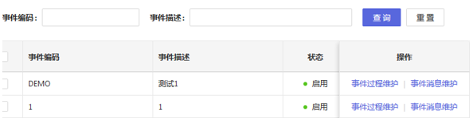

     ```javascript
     {
     	title: intl.get('hzero.common.button.action').d('操作'), align: 'center',
     	width: 200,
     	render: (_, record) => (
     		<span className="action-link">
     			<a onClick={() => { history.push(`/hpfm/event/detail/${record.eventId}`)} } >
     				{intl.get('hpfm.event.model.event.processMaintain').d('事件维护')}
     			</a>
     			<a onClick={() => { history.push(`/hpfm/event/message/${record.eventId}`)} } >
     				{intl.get('hpfm.event.model.event.messageMaintain').d('消息维护')}
     			</a>
     		</span>
     	),
     }
     ```

     

- 表格工具栏按钮

  1. 所有按钮必须有图标以及文字。

  2. 删除类按钮默认禁用状态，勾选对应的数据后启用

     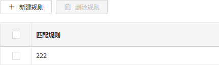

     

- 表单按钮

  用于操作整体表单的数据。

  1. 所有表单内按钮不添加图标。（例如：查询界面的查询,重置)

  2. 表单内按钮为常规按钮形式

     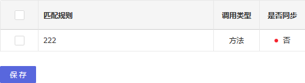

     

- 常用按钮图标（Hzero-Button）

  | **按钮含义** | **图标编码**   |
  | ------------ | -------------- |
  | 新建         | plus           |
  | 删除         | delete         |
  | 保存         | save           |
  | 下载         | download       |
  | 上传         | upload         |
  | 刷新         | sync           |
  | 导出         | export         |
  | 导入         | to-top         |
  | 展开         | down           |
  | 收起         | up             |
  | 引用         | fork           |
  | 提交         | check          |
  | 发布         | rocket         |
  | 已读         | mail           |
  | 校验         | check-circle-o |
  | 通过         | check          |
  | 退回         | close          |
  | 取消         | rollback       |

  

### 5、操作提示弹框

- 操作提示弹框

  当用户操作关键功能点，不可逆操作时，必须使用弹框加以确认。

  例如：提交，删除，审批通过，审批拒绝等。

     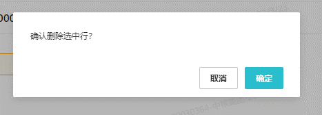

  

- 提示信息

  操作成功、失败等提示，统一在右下角显示。

     

  ```javascript
  import notification from 'utils/notification;
  
  notification.success(); // 操作成功通知提示
  notification.error(); // 操作失败通知提示
  notification.info(); // 操作信息通知提示
  notification.warning(); // 操作异常通知提示
  ```

  

## SRM二开规范

### 1、二开工程创建

1、本地项目

适用场景：不需要把子模块部署到其他地方。

项目创建：直接在父模块新建二开子模块，并复制子模块代码到二开模块下。


2、集中交付项目

适用场景：需要把子模块部署到OP和本地环境。

项目创建：

1. 新建父模块仓库，命名为srm-front-core-租户编码，复制父模块初始代码到工程中。

2. 新建子模块仓库，命名为srm-front-cux-租户编码，例如：`srm-front-cux-adient`。

3. 复制子模块初始代码到工程中，并修改package.json的name。

4. 添加二开工程到父模块和集中环境，在父模块packages目录下执行命令：git submodule add xxx（xxx为子模块https地址），不小心添加失败就删掉本地工程重新拉代码下来加。

5. 在本地初始化子模块仓库：git submodule update --init --remote --recursive。


### 2、环境配置

1、reDevelopRouter.js

添加当前项目租户编码SRM-XXX和SRM、DEFAULT。

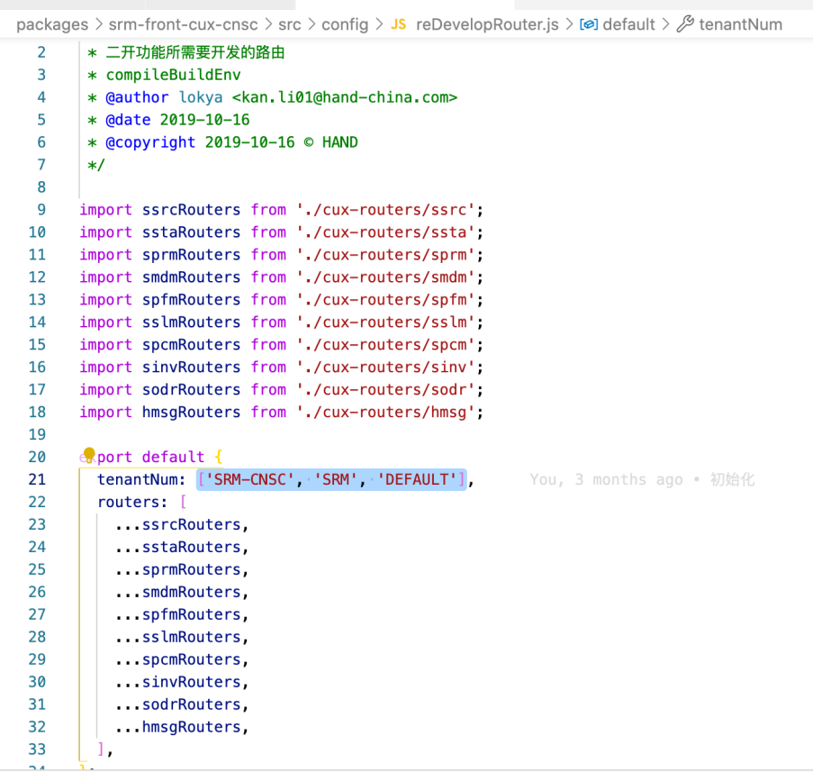


2、.hzerorc(父子模块)

- 父模块


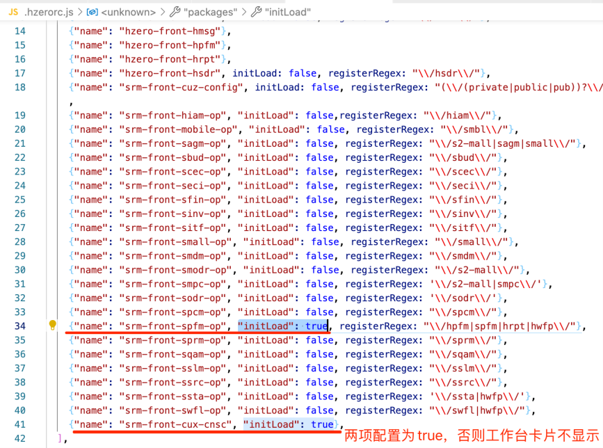

- 子模块


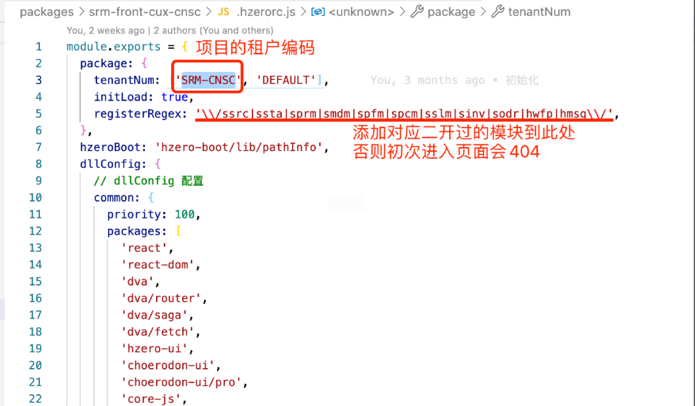


3、src/overwrite/index.js

父模块src/overwrite/index.js文件注释掉microLoadInterceptor否则二开模块不生效

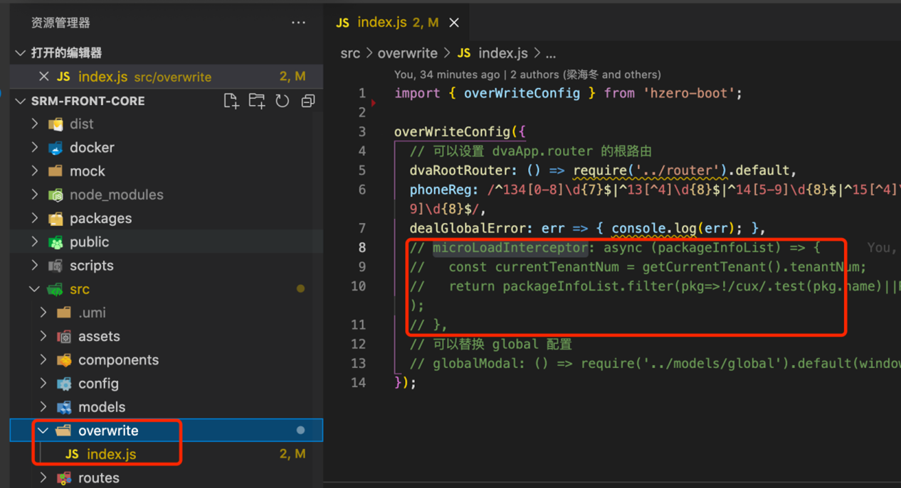


4、项目初始化

- 初始化子模块（只要执行一次）：

  git submodule update --init --remote --recursive


- 初始化父模块：

  npm install --registry=https://nexus.going-link.com/repository/zhenyun-npm-group/ 

  yarn install --registry=https://nexus.going-link.com/repository/zhenyun-npm-group/

  lerna bootstrap

  lerna run transpile

  yarn build:dll


- 启动子模块

  yarn install --registry=https://nexus.going-link.com/repository/zhenyun-npm-group/

  yarn start

  

5、modheader配置（OP环境）

安装浏览器插件modheader（谷歌和火狐都有），访问OP环境时配置，本地不需要。

下载地址：https://crxdl.com


### 3、页面开发

1、标准页面二开

::: warning 注意: 

在对标准页面二开时，务必与原技术栈保持一致。避免C7N与H0混用，造成UI风格不一致。

::: 

- 路由覆盖

  二开路由写在packages/二开子模块/src/config/reDevelopRouter.js下。

  二开路由命名规范：

  1. 路由采用三段式结构，若为二开页面，则修改path路由（在路由第二段末尾添加 -cux）。
  2. coverPath与原页面路由保持一致。

  ```javascript
  // 标准页面，原始路由
  path: /ssrc/inquiry-hall/list
  
  // 标准页面，二开路由
  coverPath: /ssrc/inquiry-hall/list // 与原始路由保持一致
  path: /ssrc/inquiry-hall-cux/list // 在路由第二段末尾添加 -cux
  ```

  ::: warning 注意: 

  reDevelopRouter.js中需要添加tenantNum，tenantNum取self接口中的tenantNum，可以 是数组或字符串形式。

  ::: 
  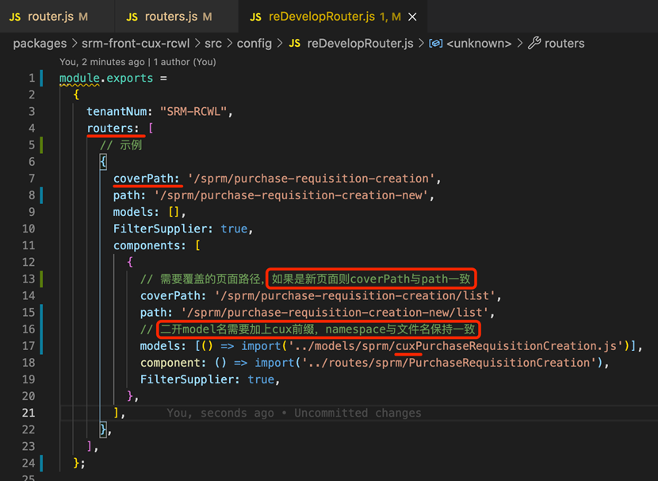

  

- 复制代码

  把需要修改的**模块对应的路由和文件夹**从源码中复制到二开模块

  ::: warning 注意: 

  不需要修改的组件，直接从原模块的lib文件引入（lib文件存在于node_modules/srm-frontxxxx-op/lib）。

  ::: 

  ```javascript
  // bad
  import CnfLabel from ‘./routes/CnfLabel’;
  
  // good
  import CnfLabel from ‘srm-front-spfm/lib/routes/CnfLabel’;
  ```

  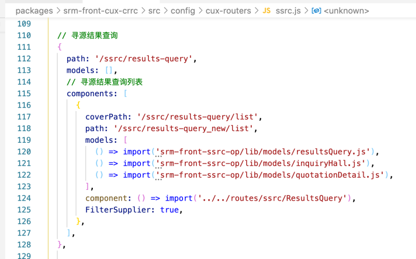
  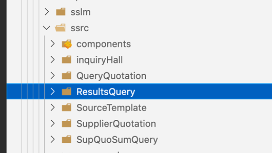

  

- 新建文件

  models、routes、sevices文件夹下分别新建二开对应的模块，如sprm
  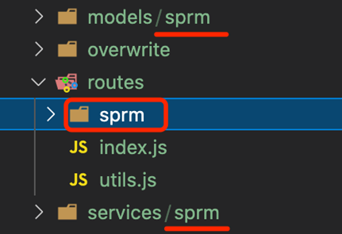

  ::: warning 注意: 

  有以下几种情况不需要修改 model 文件，其他情况下 model 都要按照规范进行修改

  ::: 

  ​    1、二开模块是新增的。

  ​    2、整个模块全部从标准功能迁移过来的。

  ​    3、父子路由模块或者兄弟路由模块间不使用相同 model 的。

  ​    4、二开模块并不改动 model 和 service。

  除了上面的情况，二开项目的 model 都要进行修改。

  

- model、命名（加前缀cux）
  1. model 的文件名称
  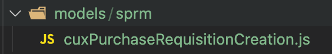

  2. 组件中的model名
  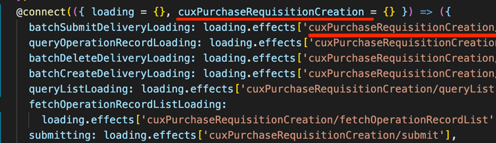
  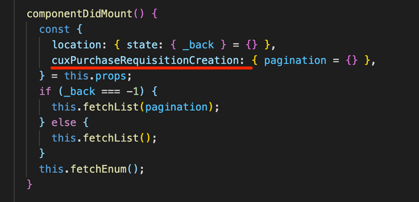

  1. model文件中的namespace
  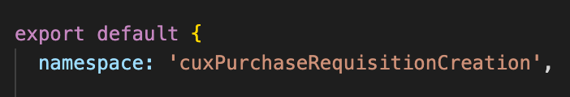

  

2、全新页面二开

1. 新建路由（path 和 coverPath 使用相同路由）。
2. 直接开发新页面。

::: warning 注意: 

全新页面开发，务必使用C7N进行开发。

::: 

### 4、分支管理

- 二开分支
  
  子模块和父模块是分别独立的仓库，因此有独立的分支，在子模块开发需要在子模块目录下创建开发分支。
  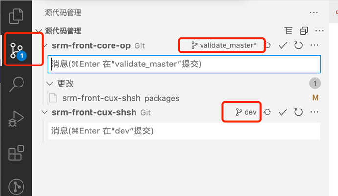


- 冲突解决

  以develop分支为例，假如feature-srm-111分支提交合并到develop分支的代码有冲突：

  1. 本地切到develop分支并同步：git checkout develop, git pull。
  2. 基于develop分支新建解决冲突的分支：git checkout -b develop-lt-fix。
  3. 合并feature-srm-111的代码：git pull origin feature-srm-111。
  4. 解决冲突后用git commit提交，然后提交合并请求develop-lt-fix合并到develop。

  

### 5、页面404排查

- modheader租户编码

  1. 检查租户编码是否与self接口中匹配
  2. 在核企租户下使用核企的租户编码，平台租户使用DEFAULT

  

- 子模块是否加载成功

  1. micro接口是否请求到子模块
  2. 控制台输出window.dvaApp._store.getState().microModule
  3. 查看当前是否加载对应租户的子模块

  

- 全局路由priority

  1. 控制台输出window.dvaApp._store.getState().global.routerData
  2. 查看当前页面路由是否有priority:1000，有则是二开路由，没有则是标准路由

  

- 菜单配置

  1. 当前租户是否正确
  2. 菜单是否正确分配到角色上


## 前端自测、提交、分支管理规范

### 1、自测

- 本地环境

  1. 在本地开发时，请检查ESLint插件是否安装并启用。（必装插件：ESLint、Prettier）。

  2. 本地开发完成在推到dev前，要保证功能的完整性，不要开发了一半，页面都报错，就合并到op环境。

  3. 不允许将console，debugger，本地联调相关注释的代码提交至仓库。

  4. 在推代码需要通过eslint检测工具，请不要强行通过检测。也不要一通不过lint就使用lint忽略。

  5. 本地要测试相关lov是否可以显示数据，下拉列表是否拥有数据等。

  6. 所有与后端发生交互的操作，loading是否正常。

  7. 不需要使用authorized参数的页面路由配置，删除authorized参数。

     

- op环境

  op环境需要开发人员确认如下几个点，在开发环境自测结束后，才可以通知测试人员进行测试，前端务必把控质量，可以减少bug数量。

  1. 菜单数据是否已经维护。

  2. 页面是否可以打开，不报403。

  3. 请求接口是否同步更新到dev，需要确定接口可以正常调用。

  4. 页面逻辑要自测，弹出框、按钮、导出、引入、显示隐藏等页面效果。

  5. 页面table，Form表单，按钮等loading状态是否正常。

  6. 数据逻辑要进行自测、增删改查以及其他业务逻辑要基本自测。

  7. 要测试相关lov是否可以显示数据，下拉列表是否拥有数据等。

  8. 二开模块，需要登录对应账号，然后查看self接口中tenantNum是否是二开的名称。

  9. 二开模块，需要登录对应账号，查看二开功能是否可以正常访问以及使用。

     

### 2、提交

- 提交信息

  1. feat：新增或者修改

  2. fix： bug修复

  3. build：主要目的是修改项目构建系统(例如 glup，webpack，rollup 的配置等)的提交

  4. ci：主要目的是修改项目继续集成流程(例如 Travis，Jenkins，GitLab CI，Circle等)的提交

  5. docs：文档更新

  6. perf：性能优化

  7. refactor：重构代码(既没有新增功能，也没有修复 bug)

  8. style：不影响程序逻辑的代码修改(修改空白字符，补全缺失的分号等)

  9. test：新增测试用例或是更新现有测试

  10. revert：回滚某个更早之前的提交

  11. chore：不属于以上类型的其他类型

      

- 提交格式

  feat + : + 空格 + 功能名称。例如 feat: 增加子账户权限页面。

  fix + : + 空格 + 修复内容。例如 fix: 修复子账户管理页面调用接口接口参数传递错误的bug。

  

### 3、分支管理

-    分支创建

  feature-opd-任务编号:

  请以 feature + opd + 任务编号 来创建分支，每次开发单个功能后，进行分支登记记录，可以在开发功能的猪齿鱼的每日工作记录中进行登记，或者在本地进行记录。一个功能一个分支，当前功能提测发正式后，删除功能分支。

  

  hotfix-opd-任务编号:

  bug修复分支，请以 hotfix + opd + 任务编号 来创建分支，同样修改完bug提测测试通过后，删除此分支。

