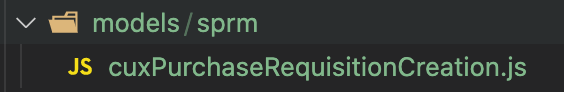
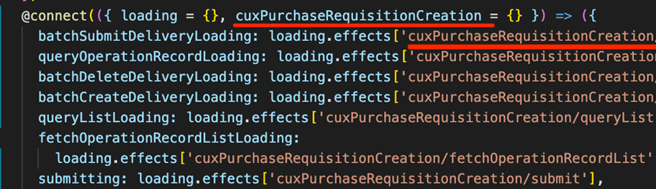

# SRM集中交付-前端二开规范

## 二开工程创建

### 1、本地项目

适用场景：不需要把子模块部署到其他地方

项目创建：直接在父模块新建二开子模块，并复制子模块代码到二开模块下

### 2、集中交付项目

适用场景：需要把子模块部署到OP和本地环境

项目创建：

​	1.新建父模块仓库，命名为srm-front-core-租户编码，复制父模块初始代码到工程中

​	2.新建子模块仓库，命名为srm-front-cux-租户编码，例如：[srm-front-cux-adient](https://open-gitlab.going-link.com/op-deliver-adient-group/srm-front-cux-adient) 

​	3.复制子模块初始代码到工程中，并修改package.json的name

​	4.添加二开工程到父模块和集中环境，在父模块packages目录下执行命令：git submodule add xxx（xxx为子模块https地址），不小心添加失败就删掉本地工		程重新拉代码下来加

​	5.在本地初始化子模块仓库：git submodule update --init --remote --recursive

## 环境配置

### 1、reDevelopRouter.js

添加当前项目租户编码SRM-XXX和SRM、DEFAULT

### 2、.hzerorc(父子模块)

- 父模块

- 子模块

### 3、src/overwrite/index.js

父模块src/overwrite/index.js文件注释掉microLoadInterceptor否则二开模块不生效

### 4、项目初始化

- 初始化子模块（只要执行一次）：

  git submodule update --init --remote --recursive

- 初始化父模块：

  npm install --registry=https://nexus.going-link.com/repository/zhenyun-npm-group/ 

  yarn install --registry=https://nexus.going-link.com/repository/zhenyun-npm-group/

  lerna bootstrap

  lerna run transpile

  yarn build:dll

- 启动子模块

  yarn install --registry=https://nexus.going-link.com/repository/zhenyun-npm-group/

  yarn start

### 5、modheader配置（OP环境）

安装浏览器插件modheader（谷歌和火狐都有），访问OP环境时配置，本地不需要

## 页面开发

### 1、标准页面二开

- #### 复制代码

  把需要修改的**模块对应的路由和文件夹**从源码中复制到二开模块

  
  
  
  
  
  
- #### 新建文件

  models、routes、sevices文件夹下分别新建二开对应的模块，如sprm

  

  

- #### model、命名（加前缀cux）

  1. model 的文件名称

  

  

  2. 组件中的model名

     

     

     

  2. model文件中的namespace

     
     
     

- #### 文件引入

  不需要修改的组件，直接从原模块的lib文件引入

  例如：import CnfLabel from ‘srm-front-spfm/lib/routes/CnfLabel’;

     
  
  

### 2、全新页面二开

1. 新建路由

2. path和coverPath使用同一个路由

3. 直接开发新页面

   

## 页面404排查

### 1、modheader租户编码

- 检查租户编码是否与self接口中匹配
- 在核企租户下使用核企的租户编码，平台租户使用DEFAULT

### 2、子模块是否加载成功

- micro接口是否请求到子模块
- 控制台输出window.dvaApp._store.getState().microModule
- 查看当前是否加载对应租户的子模块

### 3、全局路由priority

- 控制台输出window.dvaApp._store.getState().global.routerData
- 查看当前页面路由是否有priority:1000，有则是二开路由，没有则是标准路由

### 4、菜单配置

- 当前租户是否正确
- 菜单是否正确分配到角色上