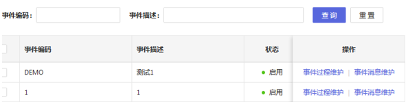
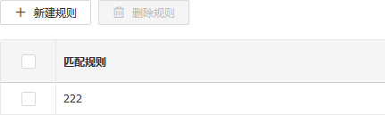
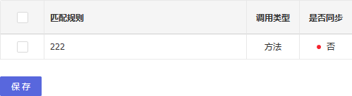
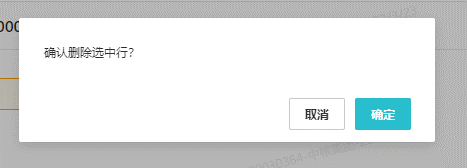
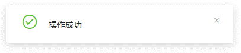

# SRM UI规范

## 1、loading

- loading使用方式

  所有与后端交互的操作必须配置loading

  如果手动配置loading，需要检查loading开启后是否可以在任何情况下关闭

  ```javascript
  // bad
  @connect(({ sqlExecute, loading }) => ({ 
      sqlExecute,
  	loading,
  }))
  
  // good
  @connect(({ sqlExecute, loading }) => ({ 
      sqlExecute,
  	executeSelectedLoading: loading.effects['sqlExecute/fetchExecuteResult'],
  }))
  ```

  

- 操作按钮添加loading效果

  ```javascript
  // bad
  <Button onClick={this.handleSaveCompany}>保存</Button>
  
  // good
  <Button onClick={this.handleSaveCompany} loading={saveCompanyLoading}>保存</Button>
  
  ```

  

- Form表单添加loading效果

  Hzero：

  ```jsx
  // 包裹 Spin
  <Spin spinning={loading}>
  	...
  </Spin>
  ```

  

  C7N：

  ```jsx
  // 包裹 Spin
  <Spin dataSet={formDS}>
  	...
  </Spin>
  ```

  

## 2、表单

- 清除缓存

  当使用Hzero-UI的Form表单时，必须清除缓存。

  ```javascript
  // bad
  @Form.create()
  
  // good
  @Form.create({ fieldNameProp: null })
  ```

  

- 表单使用规范

  表单Form不使用onSubmit属性

  表单按钮不使用icon属性

  查询按钮添加htmlType属性

  ```jsx
  // bad
  <Form layout="inline" onSubmit={this.handleSearch}>
  	// ...
  	<FormItem>
  		<Button data-code="search" type="primary" icon="search" onClick={this.handleSearch} >
  			查询
  		</Button>
  	</FormItem>
  </Form>
  
  
  // good
  <Form layout="inline">
  	// ...
  	<FormItem>
  		<Button data-code="search" type="primary" hmtlType="submit" onClick={this.handleSearch} >
  			查询
  		</Button>
  	</FormItem>
  </Form>
  
  ```

  

- Tabs.Pane切换

  在使用Tabs组件时，必须禁用Tabs.Pane动画效果， 设置 animated 为 false。

  ```jsx
  <Tabs defaultActiveKey="1" onChange={this.handleXXXX} animated={false}>
  	<Tabs.Pane />
  </Tabs>
  ```

  

## 3、列表

- 列宽

  1. 表格列的宽度要和当前列内容保持一致，不能太宽也不能太窄导致换行显示。

  2. 过长文本，使用Tooltip进行气泡提示。

  3. 所有操作列都放在最右边显示。 例如： 编辑，查看 等。

  4. 状态以及启用标记应该紧靠操作列。

  5. 状态列 ，操作列要指定宽度，建议 100。

  6. 名称或者描述建议不设置宽度，表格会自适应。

     

- 列布局

  左对齐：

  不定长度的居左，例如名称，描述, 编码

  

  居中对齐：

  固定长度的居中对齐，例如操作按钮，日期, 状态

  

  右对齐：

  金额，数量一般右对齐

  

- 列宽计算（Hzero-Table）

  1. 当表格需要滚动(默认是所有列宽度合计大于1100px 或 存在不确定宽度列 时,表格要有横向滚动(scroll.x)；

  2. 操作列 统一放右边, 当列多时, 操作列需要 fixed: right； 

  3. 当使用 fixed列时, 必须至少要有一个不确定宽度列；

  4. 当所有列宽都确定时, scroll.x = 宽度合计(宽度列)；

  5. 当存在列没有width时, scroll.x = 宽度合计(宽度列) + 宽度合计(不确定宽度列合适的宽度(至少能让标题合适)) + 1；

  ::: warning 注意: 
  当存在多个不确定宽度列(没有width)时, 未确定宽度列的宽度，为减去固定宽度列的平均值。
  :::

     ```javascript
     // 需要滚动的表格1 
     columns1 = [
     	{ title: '编码', width: 200, fixed: 'left' },
     	{ title: '名称', width: 200 },
     	{ title: '描述', width: 200 },
     	{ title: '说明', width: 200 },
     	{ title: '类型', width: 200 },
     	{ title: '启用', width: 80, align: 'center' },
     	{ title: '操作', width: 100, fixed: 'right' },
     ];
     scroll1 = { x: 1180};
     
     // 需要滚动的表格2
     // 当在最小宽度下时
     // 描述和说明的宽度 均为 160;
     columns2 = [
     	{ title: '编码', width: 200, fixed: 'left'},
     	{ title: '名称', width: 200 },
     	{ title: '描述' }, // 认为描述列适合的宽度至少为 120
     	{ title: '说明' }, // 认为说明列适合的宽度至少为 200
     	{ title: '类型', width: 200 },
     	{ title: '启用', width: 80, align: 'center' },
     	{ title: '操作', width: 100, fixed: 'right' },
     ];
     scroll2 = { x: 1101 };
     
     ```

     

## 4、按钮

- 顶部按钮

  页面顶部按钮用于放置全局操作的按钮。

  1. 页面层级的按钮统一摆放在顶部，主要功能按钮采用蓝色背景。顶部按钮有且只有一个 primary 按钮，并且位置必须在第一个。

  2. 所有按钮必须要有图标，详见常用按钮图标

  3. 删除类按钮默认禁用状态，勾选对应的数据后启用

  4. 前后端交互类型的按钮（例如保存）需要有 Loading 状态控制

  5. 顶部按钮必须使用不占位标签<React.Fragment> 包裹

     

     

- 表格按钮

  用于操作表格数据按钮。

  1. 所有按钮必须是文字描述，不得添加图标。

  2. 所有按钮统一为一列 操作 列，操作 列统一在最右边显示。

  3. 操作 列按钮在表格列比较多的情况下要锁定在最右边。

  4. 按钮数量比较多的情况下(按钮数量>4时)，可根据实际显示情况以折叠方式显示。

     

     ```javascript
     {
     	title: intl.get('hzero.common.button.action').d('操作'), align: 'center',
     	width: 200,
     	render: (_, record) => (
     		<span className="action-link">
     			<a onClick={() => { history.push(`/hpfm/event/detail/${record.eventId}`)} } >
     				{intl.get('hpfm.event.model.event.processMaintain').d('事件维护')}
     			</a>
     			<a onClick={() => { history.push(`/hpfm/event/message/${record.eventId}`)} } >
     				{intl.get('hpfm.event.model.event.messageMaintain').d('消息维护')}
     			</a>
     		</span>
     	),
     }
     ```

     

- 表格工具栏按钮

  1. 所有按钮必须有图标以及文字。

  2. 删除类按钮默认禁用状态，勾选对应的数据后启用

     

     

- 表单按钮

  用于操作整体表单的数据。

  1. 所有表单内按钮不添加图标。（例如：查询界面的查询,重置)

  2. 表单内按钮为常规按钮形式

     

     

- 常用按钮图标（Hzero-Button）

  | **按钮含义** | **图标编码**   |
  | ------------ | -------------- |
  | 新建         | plus           |
  | 删除         | delete         |
  | 保存         | save           |
  | 下载         | download       |
  | 上传         | upload         |
  | 刷新         | sync           |
  | 导出         | export         |
  | 导入         | to-top         |
  | 展开         | down           |
  | 收起         | up             |
  | 引用         | fork           |
  | 提交         | check          |
  | 发布         | rocket         |
  | 已读         | mail           |
  | 校验         | check-circle-o |
  | 通过         | check          |
  | 退回         | close          |
  | 取消         | rollback       |

  

## 5、操作提示弹框

- 操作提示弹框

  当用户操作关键功能点，不可逆操作时，必须使用弹框加以确认。

  例如：提交，删除，审批通过，审批拒绝等。

     

  

- 提示信息

  操作成功、失败等提示，统一在右下角显示。

     

  ```javascript
  import notification from 'utils/notification;
  
  notification.success(); // 操作成功通知提示
  notification.error(); // 操作失败通知提示
  notification.info(); // 操作信息通知提示
  notification.warning(); // 操作异常通知提示
  ```
