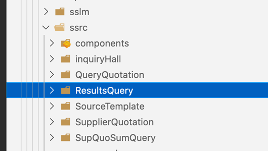

# SRM二开规范

## 1、二开工程创建

1、本地项目

适用场景：不需要把子模块部署到其他地方。

项目创建：直接在父模块新建二开子模块，并复制子模块代码到二开模块下。


2、集中交付项目

适用场景：需要把子模块部署到OP和本地环境。

项目创建：

1. 新建父模块仓库，命名为srm-front-core-租户编码，复制父模块初始代码到工程中。

2. 新建子模块仓库，命名为srm-front-cux-租户编码，例如：`srm-front-cux-adient`。

3. 复制子模块初始代码到工程中，并修改package.json的name。

4. 添加二开工程到父模块和集中环境，在父模块packages目录下执行命令：git submodule add xxx（xxx为子模块https地址），不小心添加失败就删掉本地工程重新拉代码下来加。

5. 在本地初始化子模块仓库：git submodule update --init --remote --recursive。


## 2、环境配置

1、reDevelopRouter.js

添加当前项目租户编码SRM-XXX和SRM、DEFAULT。


2、.hzerorc(父子模块)

- 父模块


- 子模块


3、src/overwrite/index.js

父模块src/overwrite/index.js文件注释掉microLoadInterceptor否则二开模块不生效


4、项目初始化

- 初始化子模块（只要执行一次）：

  git submodule update --init --remote --recursive


- 初始化父模块：

  npm install --registry=https://nexus.going-link.com/repository/zhenyun-npm-group/ 

  yarn install --registry=https://nexus.going-link.com/repository/zhenyun-npm-group/

  lerna bootstrap

  lerna run transpile

  yarn build:dll


- 启动子模块

  yarn install --registry=https://nexus.going-link.com/repository/zhenyun-npm-group/

  yarn start

  

5、modheader配置（OP环境）

安装浏览器插件modheader（谷歌和火狐都有），访问OP环境时配置，本地不需要。

下载地址：[https://crxdl.com](https://crxdl.com)


## 3、页面开发

1、标准页面二开

::: warning 注意: 

在对标准页面二开时，务必与原技术栈保持一致。避免C7N与H0混用，造成UI风格不一致。

::: 

- 路由覆盖

  二开路由写在packages/二开子模块/src/config/reDevelopRouter.js下。

  二开路由命名规范：

  1. 路由采用三段式结构，若为二开页面，则修改path路由（在路由第二段末尾添加 -cux）。
  2. coverPath与原页面路由保持一致。

  ```javascript
  // 标准页面，原始路由
  path: /ssrc/inquiry-hall/list
  
  // 标准页面，二开路由
  coverPath: /ssrc/inquiry-hall/list // 与原始路由保持一致
  path: /ssrc/inquiry-hall-cux/list // 在路由第二段末尾添加 -cux
  ```

  ::: warning 注意: 

  reDevelopRouter.js中需要添加tenantNum，tenantNum取self接口中的tenantNum，可以 是数组或字符串形式。

  ::: 
  

  

- 复制代码

  把需要修改的**模块对应的路由和文件夹**从源码中复制到二开模块

  ::: warning 注意: 

  不需要修改的组件，直接从原模块的lib文件引入（lib文件存在于node_modules/srm-frontxxxx-op/lib）。

  ::: 

  ```javascript
  // bad
  import CnfLabel from ‘./routes/CnfLabel’;
  
  // good
  import CnfLabel from ‘srm-front-spfm/lib/routes/CnfLabel’;
  ```

  
  

  

- 新建文件

  models、routes、sevices文件夹下分别新建二开对应的模块，如sprm
  

  ::: warning 注意: 

  有以下几种情况不需要修改 model 文件，其他情况下 model 都要按照规范进行修改

  ::: 

  ​    1、二开模块是新增的。

  ​    2、整个模块全部从标准功能迁移过来的。

  ​    3、父子路由模块或者兄弟路由模块间不使用相同 model 的。

  ​    4、二开模块并不改动 model 和 service。

  除了上面的情况，二开项目的 model 都要进行修改。

  

- model、命名（加前缀cux）
  1. model 的文件名称
  

  2. 组件中的model名
  
  

  1. model文件中的namespace
  

  

2、全新页面二开

1. 新建路由（path 和 coverPath 使用相同路由）。
2. 直接开发新页面。

::: warning 注意: 

全新页面开发，务必使用C7N进行开发。

::: 

## 4、分支管理

- 二开分支
  
  子模块和父模块是分别独立的仓库，因此有独立的分支，在子模块开发需要在子模块目录下创建开发分支。
  


- 冲突解决

  以develop分支为例，假如feature-srm-111分支提交合并到develop分支的代码有冲突：

  1. 本地切到develop分支并同步：git checkout develop, git pull。
  2. 基于develop分支新建解决冲突的分支：git checkout -b develop-lt-fix。
  3. 合并feature-srm-111的代码：git pull origin feature-srm-111。
  4. 解决冲突后用git commit提交，然后提交合并请求develop-lt-fix合并到develop。

  

## 5、页面404排查

- modheader租户编码

  1. 检查租户编码是否与self接口中匹配
  2. 在核企租户下使用核企的租户编码，平台租户使用DEFAULT

  

- 子模块是否加载成功

  1. micro接口是否请求到子模块
  2. 控制台输出window.dvaApp._store.getState().microModule
  3. 查看当前是否加载对应租户的子模块

  

- 全局路由priority

  1. 控制台输出window.dvaApp._store.getState().global.routerData
  2. 查看当前页面路由是否有priority:1000，有则是二开路由，没有则是标准路由

  

- 菜单配置

  1. 当前租户是否正确
  2. 菜单是否正确分配到角色上

