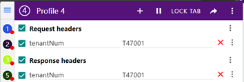
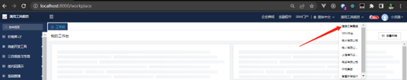
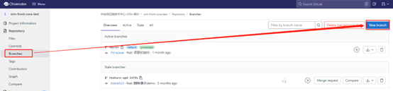
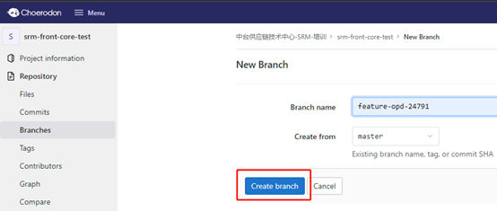
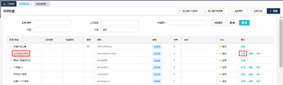
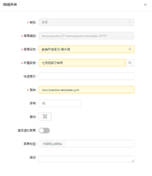
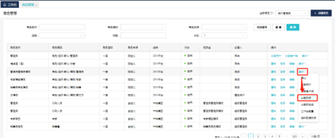
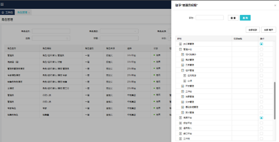

# 前端开发指导手册

## 准备工作

### 1、开发工具：

- [vscode](https://code.visualstudio.com/)

- [node](https://nodejs.org/en/)

- yarn

  ```sh
  npm install --g yarn
  ```

- lerna（安装：npm install --g lerna / yarn global add lerna）

  ```sh
  npm install --g lerna / yarn global add lerna
  ```

- [GIT](https://git-scm.com/)

  

### 2、准备工作：

- 安装开发工具（vscode）

- vscode安装ESLint插件并开启

- 前端运行环境准备（node、yarn、lerna）

- 拉取项目代码：

  - 地址：[https://open-gitlab.going-link.com/srm-july-practice/srm-front-core-test](https://open-gitlab.going-link.com/srm-july-practice/srm-front-core-test)
  - 登录账号密码：UUAP账号

- 项目初始化：

  ```sh
  yarn install --registry=https://nexus.going-link.com/repository/zhenyun-npm-group/
  
  lerna bootstrap
  
  lerna run transpile
  
  cd packages/srm-front-cux-test
  
  yarn start
  ```

- Chrome浏览器安装ModHeader插件

  下载地址：[https://crxdl.com](https://crxdl.com)
  
    
  

### 3、环境信息：

- 技术管理员：T-admin/nGdI7UZidi（配置菜单、角色、值集等操作）
- 租户管理员：15803080001/Hand@@1234056（切换至租户：通用工具集团下进行开发）
  


## 开始开发

### 1、切出开发分支

- 登录GitLab：[https://code.choerodon.com.cn/hand-0701001-srm-train/srm-front-core-test](https://code.choerodon.com.cn/hand-0701001-srm-train/srm-front-core-test)

- 基于master切出自己的开发分支：

  ::: warning 注意：

  分支命名应符合SRM前端开发规范-分支命名规范

  :::
  
  
  
  - 在代码编辑器中，执行get fetch，同步远程仓库至本地。
  
  - 执行git checkout feat-xxx，切换至自己开发分支，开始开发。
  
    

### 2、开发流程

新建页面路由文件 → 新建文件夹及文件 → 菜单配置 → 角色分配菜单 → 页面样式及功能开发

::: warning 注意：

页面路由命名、文件命名应符合SRM前端开发规范-路由命名规范

:::


### 3、菜单配置

登录技术管理员（T-admin）账号，进入菜单配置页面，进行菜单配置。



### 4、角色分配菜单

登录技术管理员（admin）账号，进入角色管理页面，对对应角色分配新建菜单。

